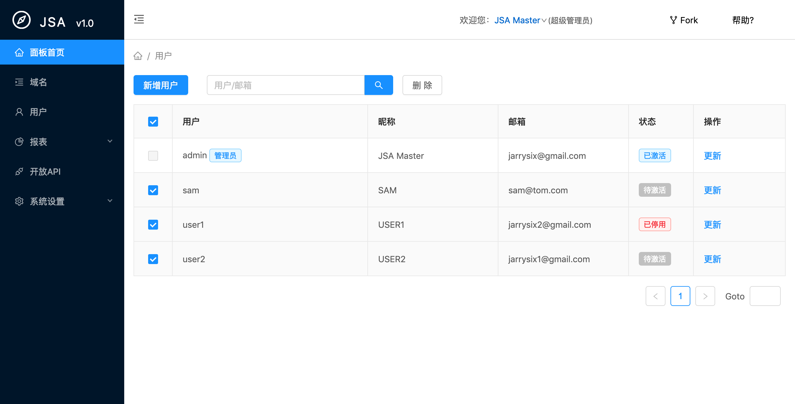

# JSA
一个使用Rust编写的短域名，及302跳转的小应用。




**相关资源**
* [JSA仪表盘项目](https://github.com/jsix/jsa-react)  
* [另外一个用go语言编写的程序](https://github.com/jsix/gord)

## 应用场景 ##
1. 做302跳转
2. 短域名，比如:to2.net/git 跳转到 http://github.com/jsix

## 管理后台 ##
```
登陆：http://localhost:8302/board
默认用户：root
默认密码: 123456
```

## 配置 ##
配置文件默认存放在conf目录下(可以通过-conf参数指定)，后缀为.conf，启动时加载目录下的所有配置。

host项支持通配，如: *.a.com 能匹配 a.com 所有子域名; 如host包含多个域，用空格分开。

## 启动 ##
```
./jsa -conf conf
```
第一次运行会生成一个默认的配置示例：
```
[
  {
    "host": "localhost *.a.com",
    "to": "http://www.google.com/{path}{query}",
    "location": {
      "/a": "http://a.com/a{timestamp}",
      "/a/b": "http://a.com/{path}{query}{timestamp}",
      "/a/*": "http://a.com/t-{*}",
      "/a/b/c": "http://a.com/{#0}-{#1}-{#2}",
      "/a/get-os": "http://a.com/?os={os}"
    }
  }
]
``` 

## Docker镜像
```bash
docker run -d --name jsa --volume /usr/jsa:/conf -p 8302:8302 --restart always jarry6/jsa
```

##  高级应用 ##
### 防止SP缓存 ###
如APP的更新服务器和更新包，直接使用地址可能会被SP强制缓存，使之无论如何无法返回正确的信息。

可以添加{timestamp}来为每个请求自动添加时间戳简单解决。
```
{
   "host": "*.to2.net",
   "location": {
      "a.apk":"http://a.com/a.apk{timestamp}"
   }
}
```
   
### 整个目录URL进行302跳转 ###

当网页或者资源，目录名称发生变化，可以通过对整个目录进行302跳转，平稳过渡。
```  
{
   "host": "*.to2.net",
   "location": {
      "/a/*":    "http://a.com/b/{*}",
   }
}
```
### 识别URL片段进行302跳转 ###

如博客有地址：/2001/12/30/1.html,现对URL进行优化，将跳转到/2001/12-30/1.html
```
{
   "host": "*.to2.net",
   "location": {
    "/*/*/*/*.html": "http://a.com/{#0}/{#1}-{#2}/{#3}.html",
   }
}
```

### 识别系统
如需要在不同环境中访问相同地址，参考如下配置：
```
 {
    "host": "localhost",
    "to": "http://www.google.com/{path}{query}",
    "location": {
      "/a/get-os": "/goto/{os}",
      "/goto/mac": "http://a.com/get-os/mac",
      "/goto/windows": "http://a.com/get-os/windows"
      "/goto/linux": "http://a.com/get-os/linux",
    }
  }
```

## 统计代码
统计代码能获取用户来源,IP及位置，如下是一个获取信息并提交到例子：
```html
<!-- 统计代码 -->
<script type="text/javascript">
var _stat_callback = function(data){
    var stat_str = JSON.stringify(data);
    var raw_cookie = $b.cookie.read("_stat_data");
    if(data["from"] != "-" || raw_cookie === ""){
        $b.cookie.write("_stat_data",stat_str,100000000000);
    }else{
        stat_str =  raw_cookie|| stat_str;
    }
    console.log(stat_str);
    $b.$fn(".stat-from-field").val(stat_str);
};
(function(c) {
   var s = document.createElement("SCRIPT");
   s.src = "//s.to2.net/static/domain_stat.js?fb5d7ff9&callback="+c;
   var f = document.getElementsByTagName("SCRIPT")[0];
   f.parentNode.insertBefore(s, f);
})("_stat_callback");
</script>

```